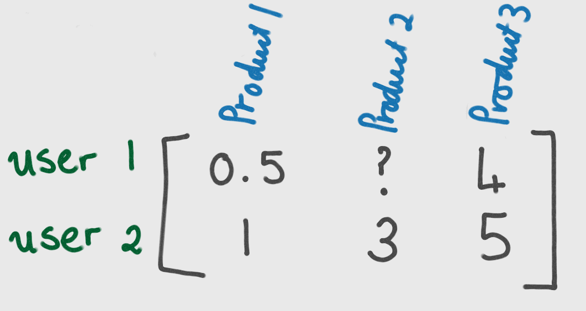

# Recommend Items using Collaborative Filtering

Article for Inspiration: https://towardsdatascience.com/alternating-least-square-for-implicit-dataset-with-code-8e7999277f4b

Library Used: https://benfred.github.io/implicit/

## Steps:
- Import libraries
- Setup Snowflake objects
- Load data to Snowflake (you may skip this step if you already have data in Snowflake)
- Write code to run Implicit library locally on your machine
- Package code to and make it clean
- Create a Task and schedule it

## Alternating Least Square for Implicit Dataset
Integration of AI and Machine learning has played a vital role in development of systems which can benefit both the Business and Business user as well. Moreover, Recommendation systems add an edge to digital businesses. 

A dataset containing explicit rank, count or category of particular item or event is considered an explicit data item. 4 out of 5 rating of a movie is an explicit data point. Whereas, in implicit dataset we need to understand the interaction of users and/or events to find out its rank/category. For example, a person watching a single genres of the movies. This kind of datasets are considered implicit. We had miss a whole lot of hidden insights if we don’t consider implicit datasets.

***Implicit dataset contains user and item interactions only.***

Data - RetailRocket dataset https://www.kaggle.com/datasets/retailrocket/ecommerce-dataset is one very good implicit data to understand Alternating least square method.

## Learn more About ALS for Recommendation Engine
1. A gentle introduction to Alternating Least Squares: https://sophwats.github.io/2018-04-05-gentle-als.html
2. ALS Implicit Collaborative Filtering: https://medium.com/radon-dev/als-implicit-collaborative-filtering-5ed653ba39fe
3. Alternating Least Square for Implicit Dataset with code: https://towardsdatascience.com/alternating-least-square-for-implicit-dataset-with-code-8e7999277f4b
4. Various Implementations of Collaborative Filtering: https://towardsdatascience.com/various-implementations-of-collaborative-filtering-100385c6dfe0

