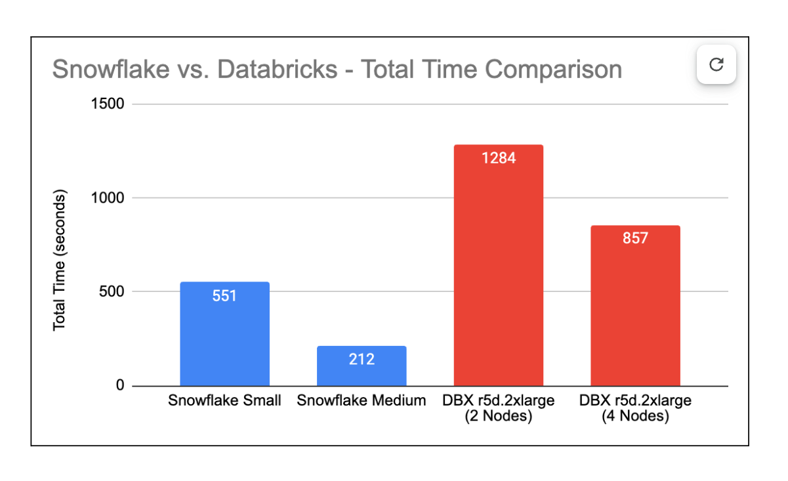

# Recommend Items using Collaborative Filtering

## Objective
Collaborative filtering is a technique that can identify items that a user might like on the basis of reactions by similar users. Most websites like Amazon, YouTube, and Netflix use collaborative filtering as a part of their sophisticated recommendation systems.

The objective of this document is to compare Collaborative Filtering model pipeline performance built on Snowflake versus alternatives like Databricks.

## Summary
Traditionally, Spark has been heralded as a fast parallel processing engine for Python applications. However, the advent of Snowflake in the Python ecosystem has introduced a significant competitor. In our comparison, we focused on the Alternating Least Squares (ALS) method for Collaborative Filtering, contrasting MLlib in the PySpark framework against the pure Python package 'Implicit' in Snowflake. Our performance evaluation was conducted using a dataset that captures the shopping behaviors of 1.4 million users.

The comparison spanned various Warehouse (cluster) sizes in Snowflake to gauge each step of the recommendation engine pipeline. The Snowflake implementation outperformed the Spark-based approach in Databricks, particularly in model inference. This stage was efficiently managed in Snowflake by leveraging User Defined Functions, enabling the generation of top-5 item recommendations for each of the 1.4 million customers through parallel computation. Overall, a Small Warehouse configuration in Snowflake achieved processing speeds ~3x faster than its Databricks Spark counterpart, and a Medium Snowpark Warehouse configuration was ~4x faster. These findings underscore Snowflake's prowess in facilitating rapid parallel computation, even for use cases that historically rely on Spark for distributed computing.

## Collaborative Filtering Explained
User reactions on a website can be explicit or implicit.

Explicit data is data where we have some sort of rating like the 1 to 5 ratings from the MovieLens or Netflix dataset, or a user liking a product shown to them. Although this type of explicit user feedback is invaluable, it’s often hard to set up and come by this data for most real-world applications.Your users might not spend the time to rate items or your app might not work well with a rating approach in the first place. You also face a cold start problem where you introduce new SKUs or entire product categories without any explicit feedback available initially.

In most real-world scenarios, companies instead must rely on implicit feedback that is tracked automatically, like monitoring clicks, view times, purchases, etc.Think of yourself and how often you give a rating after purchasing a product vs. how often you just move on after making a purchase. We focus on collaborative filtering models based on implicit data because it’s the best way for most companies to build a recommendation model.

***Implicit dataset contains user and item interactions only.***

## Dataset

For this exercise we’ll be using the “Retailrocket recommender system dataset” containing the shopping behavior of 1.4 Million users. In total there are 2,756,101 events including 2,664,312 views, 69,332 add to carts and 22,457 transactions produced by 1,407,580 unique visitors.

Retail Rocket dataset- https://www.kaggle.com/datasets/retailrocket/ecommerce-dataset

## Library Used
Given user-item interaction datasets are usually big, we require parallel/distributed computing capabilities to build models and derive recommendations. In our comparative analysis project, we are examining the performance and capabilities of ALS (Alternating Least Squares) implementations between two major data processing platforms: Databricks and Snowflake. These platforms employ different libraries and computing paradigms for distributed and parallel processing.

#### Databricks + PySpark MLlib Library:
Databricks leverages the power of Apache Spark, a unified analytics engine for large-scale data processing. Within this ecosystem, we use PySpark, the Python API for Spark, which allows for seamless integration of Python's extensive libraries with Spark's distributed computing capabilities. For our ALS implementation on Databricks, we utilize the PySpark MLlib library. MLlib is Spark's scalable machine learning library which includes an efficient implementation of the ALS algorithm, optimized for parallel processing and handling big data.

#### Snowflake Snowpark + Python Implicit Library:
Snowflake utilizes Snowpark, a robust developer framework that integrates DataFrame-style programming with the power of distributed and parallel computing in Python. Snowpark operates in a pure Python runtime environment, thereby harnessing the rich ecosystem of Python libraries while simultaneously enabling high-performance data processing. With Snowflake, we employ the Implicit library - a preferred Python library for collaborative filtering with implicit datasets. Typically recognized for its user-friendly interface and effectiveness with small datasets, the Implicit library, when combined with Snowpark's capabilities, transforms into a formidable solution for big data challenges.

## Methodology

Our methodology entailed three primary stages: Pre-processing, Model Training, and Model Inference. Each stage was tailored to leverage the unique capabilities of Snowflake and Databricks.

## References
1. A gentle introduction to Alternating Least Squares: https://sophwats.github.io/2018-04-05-gentle-als.html
2. ALS Implicit Collaborative Filtering: https://medium.com/radon-dev/als-implicit-collaborative-filtering-5ed653ba39fe
3. Alternating Least Square for Implicit Dataset with code: https://towardsdatascience.com/alternating-least-square-for-implicit-dataset-with-code-8e7999277f4b
4. Various Implementations of Collaborative Filtering: https://towardsdatascience.com/various-implementations-of-collaborative-filtering-100385c6dfe0
